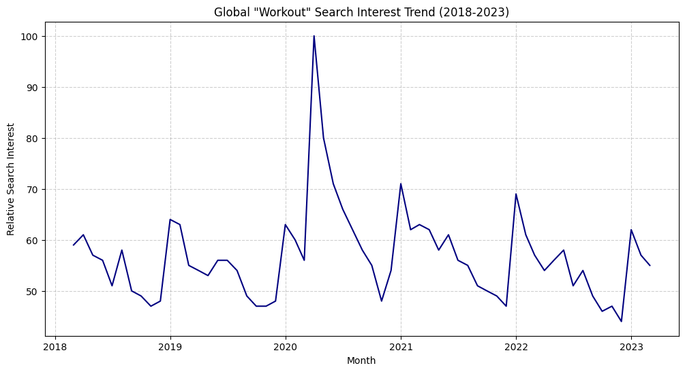
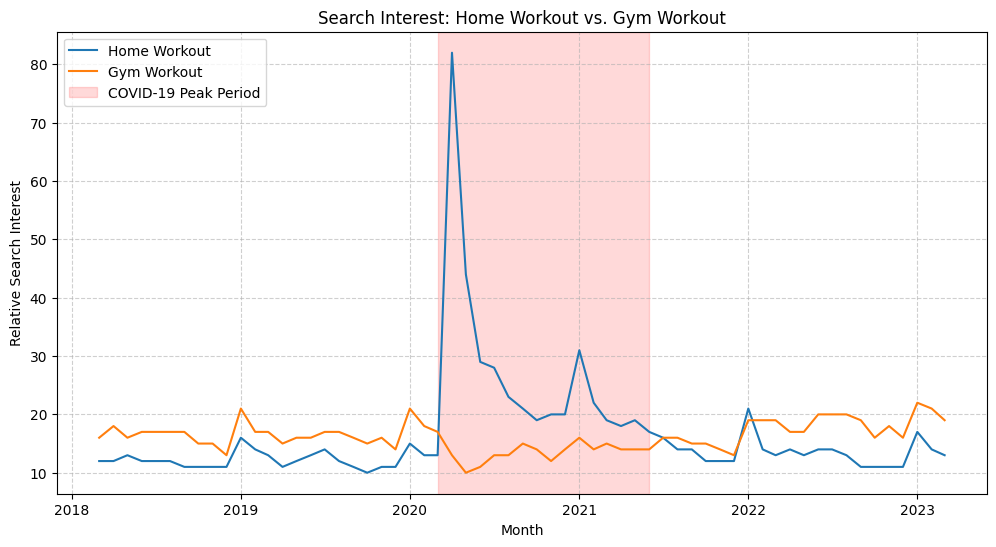
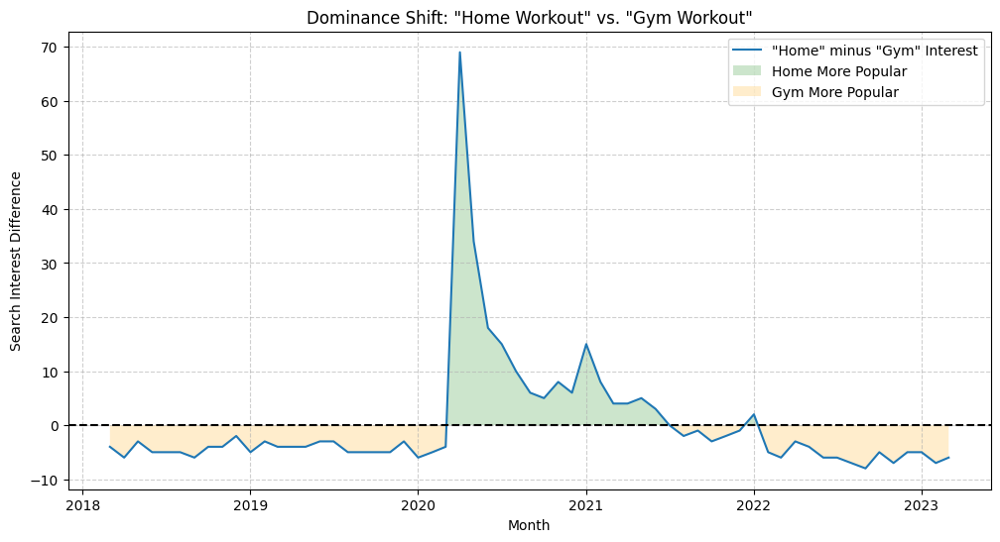
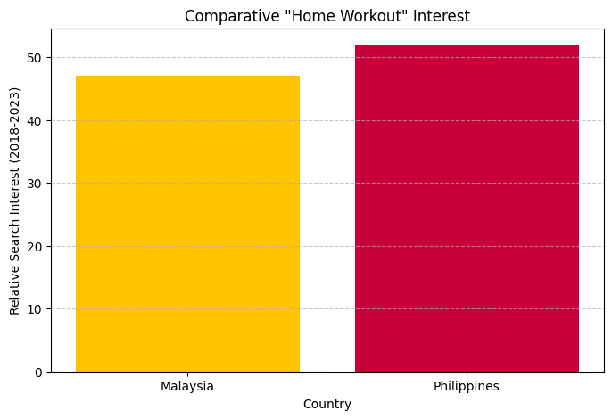

# Analysis of Global Workout Search Trends (2018-2023)

## My Motivation: From Academic Theory to Practical Application

As a student transitioning from a B.Sc. in Information Technology to a M.Sc. in Data Engineering, I am constantly seeking opportunities to bridge the gap between academic knowledge and real-world application. This project represents a key part of that journey. My goal was not just to analyze data, but to build a complete, professional, and end-to-end data analysis pipeline—from raw data to actionable insights—that showcases best practices in software engineering.

I believe that the ability to handle data with care, structure code logically, and communicate findings clearly is the foundation for any successful data-driven product, especially in the field of AI and Machine Learning.

## The Story: From Tutorial to Professional Tool

The foundational concept and dataset for this project were inspired by a tutorial on DataCamp. While the tutorial provided a great starting point, I saw an opportunity to build it into something much more robust and professional. My objective was to take a simple analysis and transform it into a resilient, automated, and well-documented software tool.

This `README.md` documents both the findings of the analysis and the engineering decisions I made to elevate the project.

### Data Source
The datasets used in this analysis were provided by DataCamp and represent anonymized and aggregated Google Trends data for various workout-related keywords from 2018 to 2023.

---

## Project Enhancements: Beyond the Tutorial

To make this project my own and to demonstrate professional software development practices, I implemented several key enhancements beyond the original scope:

*   **Modular Application Architecture:** Refactored the original script into a modular application with separate functions for each analysis step and a central configuration file (`config.py`).
*   **Data Quality Assurance:** Integrated a dedicated data quality check as the first step in the analysis pipeline, ensuring the integrity and reliability of the input data before any processing occurs.
*   **Reproducible Environment:** Created a complete, reproducible environment using a `requirements.txt` file, ensuring any other developer can run the analysis seamlessly.
*   **Interactive Command-Line Interface (CLI):** Transformed the script into a reusable tool by adding `argparse`, allowing a user to run specific parts of the analysis on demand.
*   **Unique Analytical Insights:** Developed a new, unique analysis to visualize the "dominance shift" between "Home Workout" and "Gym Workout" searches, providing a deeper insight than the original analysis.
*   **Professional Documentation:** Created this comprehensive `README.md` to document the project's motivation, findings, and technical implementation.

---

## Key Questions Explored

1.  How has the general interest in "workout" evolved, and when did it peak?
2.  What was the impact of the COVID-19 pandemic on searches for "Home Workout" vs. "Gym Workout"?
3.  How did the popularity of "Home Workout" directly compete with "Gym Workout" over this period?
4.  Which country has the highest overall interest in workouts?
5.  Between the Philippines and Malaysia, which has a stronger market for "Home Workout" products?

---

## Key Findings & Visualizations

### 1. Overall Interest Peaked During the Pandemic
The global search interest for the term "workout" saw a dramatic spike in early 2020, which directly correlates with the onset of global lockdowns.



### 2. "Home Workout" Dominated During COVID-19
During the pandemic, "Home Workout" searches massively outpaced "Gym Workout." Post-pandemic, gym-related searches have recovered, but "Home Workout" remains a strong competitor, indicating a lasting shift in fitness habits.



### 3. The Dominance Shift: Home vs. Gym
This unique analysis plots the difference in search volume between "Home Workout" and "Gym Workout." It clearly shows that before 2020, gym workouts were consistently more popular (orange area). The pandemic caused a massive and immediate shift in favor of home workouts (green area).



### 4. Geographical Interest: Philippines Leads in Home Workouts
The analysis of geographical data shows that while some countries have high overall workout interest, specific markets show unique trends. When comparing potential expansion markets for home workout products, the Philippines shows significantly higher search interest than Malaysia.



---

## Technologies Used
- Python
- Pandas
- Matplotlib
- Git & GitHub
- Anaconda

---

## How to Run This Project

1.  **Clone the Repository**
    ```bash
    git clone https://github.com/hishamsalih2000/workout-trend-analysis.git
    cd workout-trend-analysis
    ```

2.  **Set Up the Environment**
    ```bash
    conda create --name workout-market-analysis python=3.9
    conda activate workout-market-analysis
    ```

3.  **Install Dependencies**
    ```bash
    pip install -r requirements.txt
    ```

4.  **Run the Analysis**
    The script is an interactive tool. You can run the full analysis or specific parts.

    *   **To run the full analysis (generates all plots):**
        ```bash
        python main.py --analysis all
        ```

    *   **To run only the geographical analysis:**
        ```bash
        python main.py --analysis geo
        ```